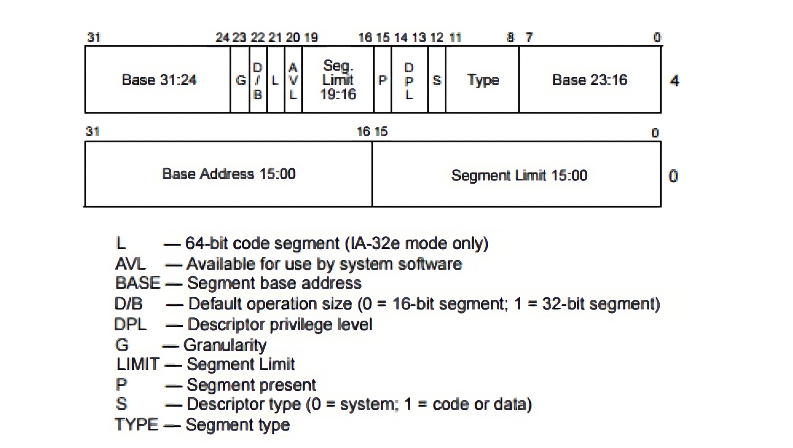
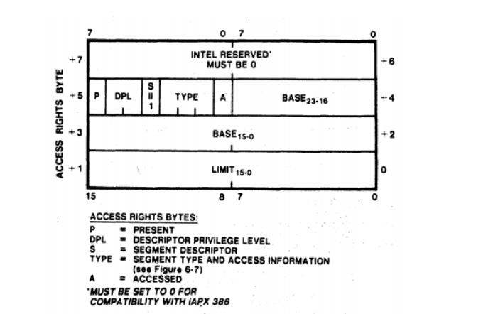
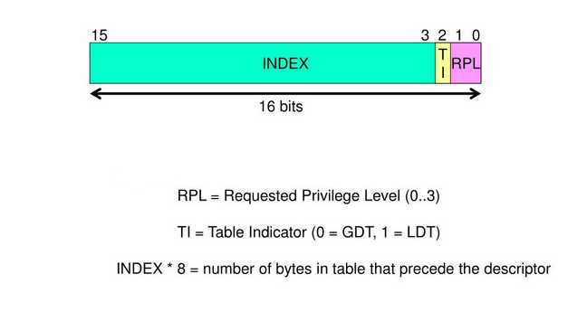

# x86 Memory Segmentation

> **_NOTE:_** This chapter aims to cover almost the entire x86 segmentation 
architecture.
This is to give you enough knowledge for most cases where you would be developing in 
x86 architecture and everything said here is not strictly required for the creation of 
our operating system. 
I will be marking all optional knowledge with an **Optional** note.
You could even skip this chapter and return to it in future when it's mentioned again.

What is memory? Well, physically, we can think of memory as just an
array of bytes, each having a memory address that is just a numerical
value, which we commonly store in base 16; this is our physical view of memory, 
we need a logical view of memory that can make a lot of things much
easier. This is where memory segmentation comes in.

Memory segmentation in x86 architecture is a mechanism that divides the
address space into segments to allow for more flexible memory management and
protection. Understanding is important when developing an
operating system for x86 platforms, as in protected mode, memory segmentation is 
part of the address translation process. You can configure it to work alongside
other memory management methods like paging.

Memory segmentation isn't really used in the modern day; it's an old way
of managing the address space, and modern operating systems mainly use 
paging for memory management, which we will use in our operating 
system; we'll get into that much later.

Memory segmentation works differently in real mode and protected mode.
Let's look at them individually, starting with a basic overview and
then looking at how it's done in real mode.

## How does memory segmentation work? An overview

First, let's look at a basic overview of how memory segmentation works,
segmentation is where the address space is divided into parts called segments.
Each segment can contain related code or data. To access data inside a
segment, each byte is referred to by its own offset. A program can use different
segments in x86; three commonly used segments are:

-   Code segment: Used to access code being executed
-   Data segment: Used to access data belonging to the program.
-   Stack segment: Stores the data of the program's stack

## How does memory segmentation work in real mode?

We will start with real mode just so we can be clear without having to
cover all the extra stuff you have to consider in protected mode
(like global descriptor tables). In real mode, segmentation is built
into the way the processor calculates memory addresses, so there is
no way to avoid it. It's also worth mentioning that the offset in real mode 
is 16 bits, so a segment can address up to 64KiB. In real mode, we have
16-bit segment registers. The main ones we will use are:

-   CS: used to define a code segment
-   SS: used to define a stack segment
-   DS: used to define a data segment

There's also other registers that we can use:

-   ES: A segment register that provides flexibility in memory
    access, used when you need to access more segments without
    changing the value of `ds`.
-   GS: A segment register that can be used for general-purpose segmented 
    memory access.
-   FS: A segment register that can be used for general-purpose segmented 
    memory access.

Each segment register contains a segment value, which is used to 
calculate the segment's base addresses. We can reach any byte within 
that segment by using an offset.

Let's look at an example for memory segmentation.

Assume we have some code for a program loaded into memory, which is
stored at physical address 1000h. To reach the first byte, we would just set our
offset to 0, and increase it for any next byte we want to access. We
would also set the `cs` register to `1000h`, which makes the segment's base address `1000h`
for the current code segment we are trying to run.

x86 always runs with memory segmentation in mind, so when we use a near `jmp`
instruction, we are changing the instruction pointer to a new 
offset within the current code segment, so let's
say we write `jmp 100d`, we are actually jumping to the offset of 100d
inside the current code segment. This also happens internally with the
PC (program counter), where the instruction pointer (`IP` in 16-bit mode) 
stores the offset of the next instruction. Any jump to a location
in the same code segment is called a near jump/call; otherwise, it's
called a far jump. To do far jumps, you can do stuff like `jmp
900:1d`, this will load `900d` into `cs` and `1d` into `ip`.

The same general idea applies to data and stack segments; it
was just easy to show using and jump/call because the
functionality is related to code, which is easy to manipulate code flow.
An example for DS would be `lodsb`, and for `ss`, the `push` instruction.

## How was memory segmentation used in the bootloader? 

When we wrote the bootloader (and the basic kernel), we
dealt with segments. Let's look at our code. I can now explain it
now that you know everything you need to know about memory segmentation
in real mode.

The first thing we will look at goes all the way back to when we wrote
our printing code together, this is in the start label, here:

```x86asm
    mov ax, 07C0h
    mov ds, ax
```

It's worth noting that the `cs` register is already set to 07C0h
in our bootloader setup. We also set the same value to the DS register.
This ensures the bootloader can correctly access its own code and data
correctly. But you might ask, "why do we need to load the location
into `ax` and then `ds`?". This is because we can't load an immediate value
directly into a segment register, so we use `ax` as an intermediary register
to load into `ds`.

Moving on, the next place we used memory segmentation

This is when we were trying to load the kernel into memory from the
bootloader. More specifically, this was when We were trying to use the
`INT 13h`, `ah = 02h` service, which is the BIOS service for reading sectors
from a disk into memory. Which we see in this code here:

```x86asm
    load_kernel_from_disk:
    mov ax, 0900h
    mov es, ax

    mov ah, 02h ; service number, 
    mov al, 01h ; number of sectors we want to read from (only simple kernel for now, so less than 512 bytes)

    mov ch, 0h ; low 8 bits of the cylinder number, which is 0.
    mov cl, 02h ; sector number we would like to read, this is the second sector

    mov dh, 0h ; the head number we would like to read from, this is head 0.
    mov dl, 80h ; BIOS drive number, 80h is the first fixed disk 

    mov bx, 0h ; memory address where the content will be loaded
    int 13h ; int 13h provides bios disk services
```

Here, what we do first is store 0900h into the extra segment register, so 
the BIOS read will use 0900h as the segment for the destination address, you see, the
interrupt `13h`, `ah = 02h` service loads the requested sectors
into the memory address `es:bx` (where `bx` is the offset).

Then after we do that, we can perform a far jump to the segment 
where the kernel was loaded. It's worth noting that a far
jump changes the value of the `cs` register to wherever you jump to; in
this case, it's set to 0900h, which makes the kernel's code segment base
`9000h` in real mode. Then, in our kernel, we can
set the `ds` register to the same as the `cs` to read code and data
from the same segment.

## How does memory segmentation work in protected mode? An intro to the Global Descriptor Table

We have got down how memory segmentation works in real mode, and even
know how it's used in our bootloader. That's pretty good; now we've
just got to cover protected mode, and we're done with memory
segmentation and can move onto the run time stack.

The basic idea of memory segmentation in protected mode is similar 
to real mode. But protected mode adds descriptor tables and protection
features that change how segments are defined and accessed.

In protected mode, we have something called the global descriptor table
(GDT); this is stored in main memory, and its base address is stored in the 
global descriptor table register (GDTR). Just to
clarify, the GDTR is a special register that stores the base address and limit
of the GDT

Each entry in this table is called a segment descriptor; each segment descriptor
has a size of 8 bytes, and a segment selector contains an index 
used to locate a descriptor. The index in the segment selector is used
to locate a descriptor in the GDT; each descriptor is 8 bytes. Each entry in the GDT
defines a segment (of any type) and has the info required by the CPU to
deal with that segment. For instance, the starting memory address of the
segment is stored, and the size/limit of the segment is stored.

Furthermore, as we have this focus around the GDT, our segment registers
from real mode no longer store direct addresses, they store segment
selectors.

### The structure of the segment descriptor, a basic overview

As we said before, a segment descriptor is an entry of the GDT worth 8
bytes; it's made up of fields and flags that describe the
attributes of any segment in memory. The processor will then go to the
descriptor that describes the segment when we need to get information
about a segment, like the starting memory address (of said segment). As
well as storing basic info, a segment descriptor stores info that helps
in memory protection; this makes memory segmentation not just a logical
way of viewing memory, but a method of memory protection, protecting
different segments on the system from each other, and not letting less 
privileged segments manipulate data or call code in certain places
(typically more privileged areas of the system).

### How we use segments when calling and interacting with other memory

The most important information about a segment is its base address.
In real mode, the segment register contains the value used to calculate the
base address. In protected mode, the base address is stored in the segment descriptor. 


When currently running, code refers to a memory address to read from or
write to (with data segments) or to call somewhere (with code segments).
It's actually referencing a segment and an offset within that segment. 
This combination of a segment selector and offset is a logical address,
not a physical memory address. Meaning it doesn't actually
reference the place in which data gets stored; it's simply a logical
representation of where we need to go relative to the program's address
space. In this case, a logical memory address is a segment selector and
offset, to point to the memory location we want to go.

A logical address identifies a location using a segment selector and an offset,
and to actually reference this, it needs translation into a physical memory address.

In x86, a logical memory address may go through two translation
processes instead of one to receive a physical memory address. The first step
turns the logical address into a linear address. This step is performed by segmentation,
regardless of whether paging is enabled. If paging is enabled, a second 
translation process occurs to turn the linear address into a physical address.
If paging is disabled, the linear address is used directly as the physical address. 
For now, we will only focus on the process 
to turn a logical memory address into a linear memory address.

For the 32-bit protected mode we are using, a logical address consists
of a 16-bit segment selector and an offset. The offset can be up to 32 bits. 
When this is logical address gets generated by currently running code, 
the processor uses the segment selector to obtain the segment descriptor
and then uses the descriptor to calculate the linear address.

First we read the value of the register GDTR (which contains the base 
address of the GDT),
then we use the segment selector in the logical memory address in order
to locate the descriptor of the segment; this descriptor then contains
the base address of the segment; the processor then obtains this base
address, and adds it to the offset. This provides us with the linear memory 
address.

### Memory protection in this process, and segment limits

During this process of translation, other information from the segment descriptor
is also used to provide memory protection. One of these pieces of
information is called the limit of a segment, the limit defines the highest offset that 
can be used for a segment. If an access uses an offset outside the allowed range,
the processor generates a protection exception.

The limit of a segment is stored in the 20-bit "segment limit field"
of a segment descriptor; how the processor interprets the value of the
segment limit field depends on the granularity flag (G flag), which is
also stored in the segment's descriptor. When the value of the G flag
is 0, this means the value of the limit field is interpreted as bytes.
If the G flag is 0 and the segment limit field is 20, the 
highest valid offset is 20, so the segment can contain 21 bytes.
On the other hand, when it's set to
1, the value of the segment limit field will be interpreted as 4KB
units. To see what this means, assume the value of the limit field is
20, but the G flag is 1. This means that the size of the segment will be
20, but because the limit is inclusive, offsets 0 through 
`20 x 4 KiB + 4095` are valid, so the segment can contain 
`21 x 4 KiB = 84 KiB`.

Because the size of the segment limit field is 20 bits, this means that
the maximum numeric value it can represent is `2^20 - 1`, this means that is the
G flag is `0`, the maximum effective segment size is 1MiB when G is 0, and 4GiB when 
G is 1.

### Back to the structure of the descriptor, looking more in depth

I can show you the complete structure of a descriptor using a diagram
taken from the "Intel® 64 and IA-32 Architectures Software Developer's
Manual (Volume 3A)," seen here:



The first 16 bits (bit 0-15) are the first 16 bits of the segment's
limit. The next 24 bits are the first 24 bits of the segment's base,
then we have our type field, S flag, DPL field, P flag, Then we have the
next nibble of our limit, the AVL flag, the L flag (for 64 bit), the DB
flag, the G flag, and the next section of our base.

You may be wondering, why is the segment descriptor formatted so
strangely? And this layout is inherited from the 80286 descriptor format; 
here is a similar diagram seen from the
Intel 80286 Programmer's Reference Manual:



On the 80286 diagram, the base size was 24 bits, and the limit's size
was 16 bits, then we just extend this for our newer processor
architecture.

### A segment's type

When a segment gets defined, the processor should know how to interpret
the content inside this segment; this is defined by the segment's type.
We know so far that there are code segments and data segments, these
two types belong to a category of segments called application segments;
there is another category called system segments, and many types of
segments belong to it.

Whether a specific segment is an application or system segment, is
defined in the S flag, also known as the descriptor type flag, which is
bit 4 of the fifth byte of the segment descriptor. When the S
flag is 0, the segment is considered a system segment; when it's an
application segment, the value of S is 1. We will focus on when the S
flag is 1.

The only application segments are code and data. If some application
segment is referenced by currently running code, the processor will go
to the descriptor of this segment and by reading the S flag (which
should be 1), it should know that the segment in question is an
application segment, but how does it know whether it's a data or code
segment? This info is stored in a field called the type field in the
segment descriptor.

The type field is the low 4 bits of the fifth byte of the segment descriptor.
The most significant bit specifies if the application
segment is a code or data segment; the least significant specifies
whether the segment has been accessed or not; When the value of this is
1, this means that the segment has been written to or read from, but if
it's 0, this means that the segment has not been accessed. The processor sets 
the accessed bit when the segment is accessed after its descriptor is loaded 
into a segment register. In any other
situation, It's up to the OS to decide the value of the accessed flag.
According to Intel, this flag can be used for virtual memory management
and debugging.

The other two bits or flags of the type field depend on whether it's a
code or data segment. Let's cover those individually.

### The type field for Code segments

> [!NOTE]
> **Optional:** You do not need to understand conforming code segments 
> to continue with this operating system, but it's nice to know.

When the segment is a code segment, the second most significant bit of
the type field is called the conforming flag (C flag), whereas the third
most significant bit is called the readable flag (R flag), starting with
the simplest being the R flag.

The value of this flag indicates how the code inside the segment can be
used, when the value of the R flag is 1, the code segment can be read,
while a value of 0 means it cannot be read as data.

The conforming flag is all to do with privilege levels. When a segment
is conforming (the value of the conforming flag is 1), this means that
code running at a less-privileged level can call a conforming code segment with 
a more privileged `DPL` without changing its own privilege level. 
Why would we want this? Well, the
kernel can sometimes provide code that is basic and may be needed by
many programs. This code would have a privilege level of 0, as it's a
part of the kernel and would gain the highest privilege level; 
any other programs, which would have a lower privilege level wouldn't
really be able to call this without the conforming flag. This is why
it's needed.

### The type field for Data segments

Now, when we are working with data segments, the second most significant bit 
is called the expansion-down flag (E flag), and the third most significant bit 
is called the writeable flag (W flag).

The write-enabled flag gives us the ability to decide whether we want
our data segment to be read-only or not; when set to 0, the data will be read-only;
when set to 1, the data segment is writeable.

The expansion-direction flag will be covered when I move onto the x86
run-time stack. For a vague definition now, we could say that when the value of 
the flag is 0, the data segment is an expand-up segment, but when the value is 1,
it's an expand-down segment. (These are Intel's terms, so don't blame me).

An extra thing about data segments is that all of them are
non-conforming, which means less privileged code cannot access data at a
more privileged level, and more-privileged code can access less-privileged data
segments, subject to the processor's privilege checks.

### Privilege levels in segments

Prior, I have probably stated that a segment descriptor has a privilege level, 
and based on this, there are rules for how certain
segments can interact based on these privilege levels. Which the
processor would enforce; these privilege levels are defined by the
descriptor privilege level (DPL) in the segment descriptor; as this is a
2 bit value, the possible privilege levels are 0, 1, 2, and 3, the DPL bits
5 and 6 of the fifth byte of a descriptor.

### The other flags: The D/B flag

There's only 3 flags left that I haven't covered. The first is a flag
whose name changes depending on the segment it resides within; it is
located within the second. Most significant bit in byte 6 when it within
a code segment, it's called the default operation size flag (D flag),
When the processor executes the instructions, it uses the D flag to
choose the length of the operands, depending on the currently executing
instruction. If the D flag is 1, the default operand size is 32 bits and the 
default address size is 32 bits; if it's 0, both default to 16 bits. Individual
instructions can use prefixes to override these default sizes when supported.

When the segment is a stack segment, the same flag is called the default
stack pointer size flag (B flag), and it determines the default stack-address size
used by stack instructions. Which is commonly known as the stack
pointer, used by stack instructions such as push and pop. When the value
of the B flag is 1, then the size of the stack pointer will be 32 bits,
and stack instructions use ESP as the stack pointer. When the value of
the B flag is 0, the size of the stack pointer will be 16 bits, and
stack instructions use SP as the stack pointer.

For an expand-down data segment, the B flag controls the upper bound of the 
segment; when its value is 1, the upper bound is 4GiB; when it's 0,
the upper bound is 64KiB.

For the 32-bit protected-mode segments we will use, the D/B flag will
normally be set to 1.

### The other flags: The L flag

This is known as the 64-bit code segment flag (L flag), which is bit 5
of byte 6. If the value of this flag is
1, that means the code inside this segment is 64-bit code, while 0 means
the opposite; when the L flag is 1, the D/B flag must be 0.

### The other flags: The AVL flag

This flag doesn't really have any particular meaning for the processor,
this flag is available for the OS to use in whatever way it
needs, or it's just ignored.

And that wraps up all coverage of the descriptor, moving on.

### More on the GDTR

As we know, the GDTR stores the base address of the global
descriptor table, but it also stores the limit of the table. To load a
value into the register of the GDTR, follow the instruction:
the `lgdt` instruction must be used; this stands for "load global
descriptor table." It takes one memory operand containing the `GDT`'s linear base address and limit. 
These operands structure should be similar to the actual
structure of the GDTR, which is shown here:


We can see it's 48 bits long, starting with the 16-bit limit, and then
the 32-bit linear base. The memory operand contains the 16-bit limit 
followed by the 32-bit linear base address. 
This also means that we have some limits to our GDTR, as the limit
is a 16-bit number, so the maximum GDT size is 64KiB (65536 bytes).

### The local descriptor table

> [!NOTE]
> **Optional:** LDTs are part of the x86 segmentation architecture, but we
> will not use them in this operating system. You can skip this section 
> and return to it later if you want to learn more about x86 segmentation.

The GDT is a system-wide descriptor table that can be used by all 
processes. x86 also gives us the power to create local
descriptor tables (LDTs) in protected-mode, An LDT contains segment descriptors like a GDT,
but it is associated with a particular LDT descriptor and can be used for a more local set of 
segments. Multiple of these LDTs can be
made; each one can be private to a specific process currently running on
the system; multiple processes can also use the same LDT if the operating
system chooses to do so.

How to use an LDT depends on how the kernel is being designed; whereas the GDT
is the standard system descriptor table, the LDT is optional and in the
hands of the designer. To use an LDT, a system-segment descriptor describing
the LDT is created in the GDT; the LDT table will be considered as a system segment,
so the value of the S flag would be 0, and because there are many
different system segments in x86, we would then have to define that this
is an LDT. This is done via the type field, and its type field should have the value
`0010b`. How the processor can tell which table should be used at the moment 
for a given segment between the GDT and the LDT will be
discussed when we talk about segment selectors.

The x86 instruction `lldt` is used to load the segment selector for the LDT into the 
LDTR. The processor then uses that selector to locate the LDT descriptor in the GDT 
and loads the LDT's base address, limit, and attributes into the LDTR.

### More on the segment selector

In reality, the way we described the segment selector before as an
index, is not actually true; the index is only one part of the segment
selector. A full diagram of it can be seen here:



We can see that it is 16 bits, and the lowest two bits are the "requested
privilege level" (RPL). The next bit is the table indicator (TI). 
Then we have our usual index field, which we know much about.

The TI flag is used by the processor to tell if the index in the segment
selector is an index in the GDT or the LDT; when it is at 0, the index
signifies the GDT; when it's 1, the index refers to the current LDT; the 
processor uses the LDTR to locate that LDT, and then the descriptor on the LDT is read.

The RPL, as the name suggests, is to do with privilege levels; we
mentioned before the DPL, the privilege level of a given segment, and
there also exists the CPL. Which is the privilege level of the currently
executing code. The RPL is part of the privilege checks performed when code
accesses a segment. The RPL is compared with the CPL and the descriptor's 
DPL during privilege checks; it does not simply define the caller's privilege level.
